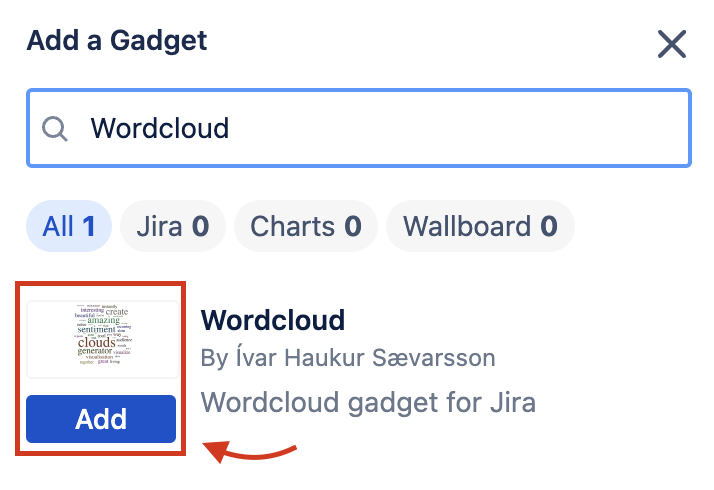

# Wordcloud for Confluence Documentation

## **Installing the app**

- Log in to your Confluence instance as an admin.
- Go to Apps tab.
- If Wordcloud for Confluence did not appear in the list on the drop-down menu, click Explore more apps to install the app.
- Search for Wordcloud for Confluence.
- The app tile appears as the search results filter.
- Click the Wordcloud for Confluence app tile.
- The Add to Confluence screen appears.
- Click Get app.
- The app installs.

## **Adding the macro to your Confluence page**

- Go to any Confluence page where you want to add your wordcloud.
- Press Edit (or 'e')

- Type `/wordcloud` on the page and select the Wordcloud for Confluence macro.

- Click the Edit button in the top right in the Dashboard view.

- Find the Wordcloud gadget in the search by typing ‘Wordcloud’, click ‘Add'

- Your Gadget is added to the Dashboard and you can configure it before displaying a wordcloud.

- Configuration options:
  - **Size**: Select a size for your wordcloud - options Large, Medium or Small.
  - **Filter stopwords**: If enabled, common stopwords like ‘from, to, hello, I, you' are removed from the wordcloud
  - **Include subpages**: If enabled, the macro will display words from subpages of the current page.
- Note: All configurations are auto-saved on update.
- Once configured, you can hit publish and wordcloud will be displayed on the Confluence page.

