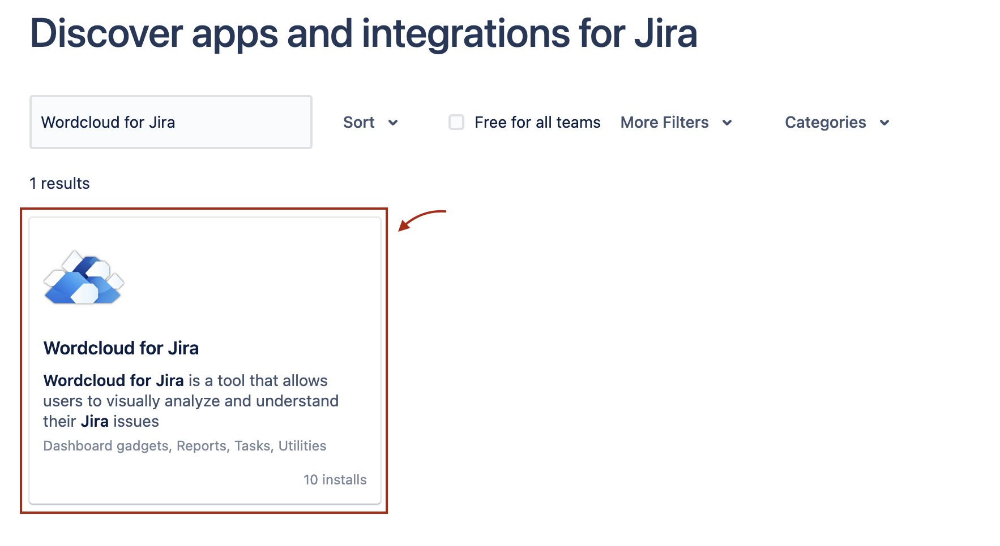
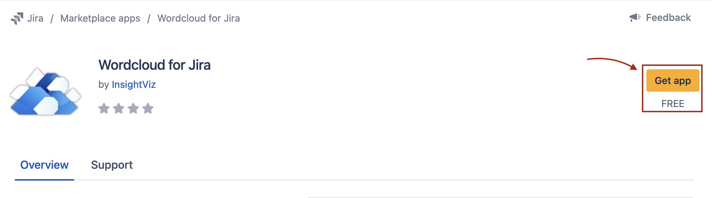
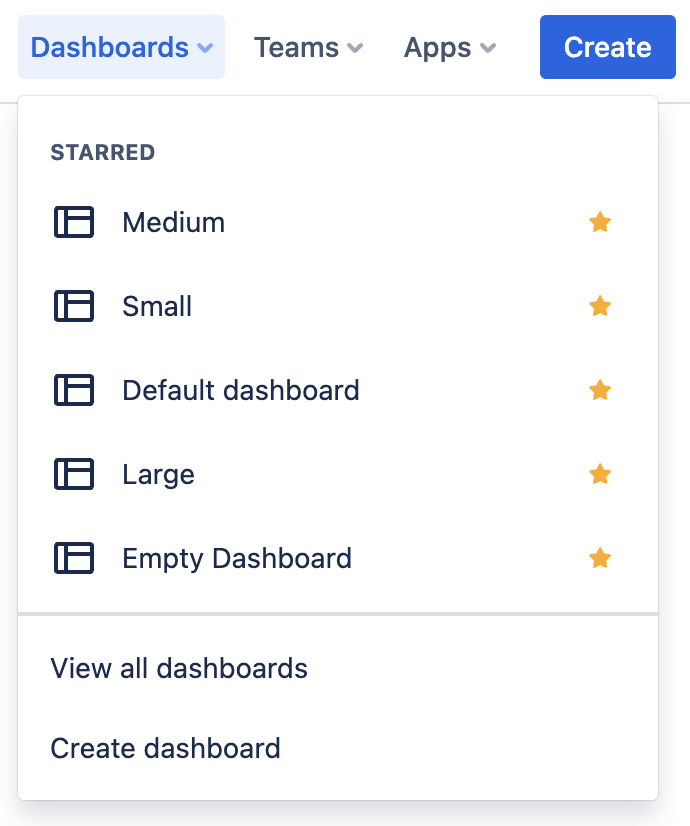
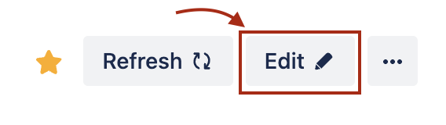
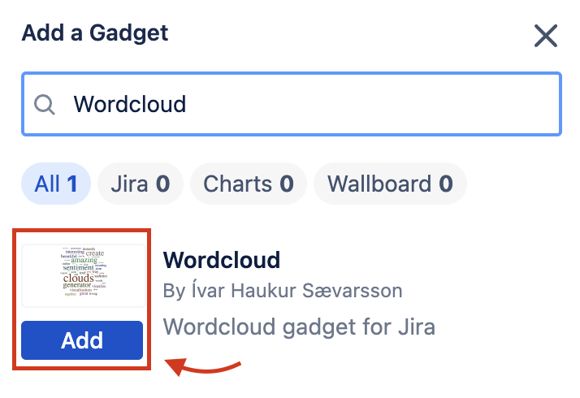
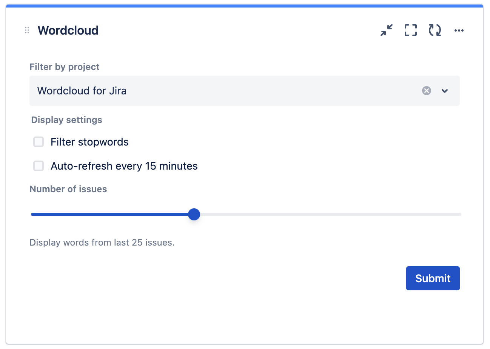
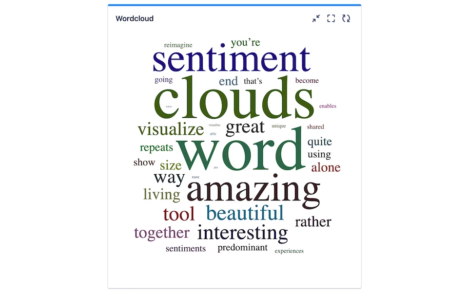

# Wordcloud for Jira Documentation

## **Installing the app**

- Log in to your Jira instance as an admin.
- Go to Apps tab.
- If Wordcloud for Jira did not appear in the list on the drop-down menu, click Explore more apps to install the app.
- Search for Wordcloud for Jira.
- The app tile appears as the search results filter.
- Click the Wordcloud for Jira app tile.
  

- The Add to Jira screen appears.
- Click Get app.
  

- The app installs.

## **Adding the gadget to your Dashboard**

- Go to Jira Dashboards and either create new or select an existing one.

- Click the Edit button in the top right in the Dashboard view.

- Find the Wordcloud gadget in the search by typing ‘Wordcloud’, click ‘Add'

- Your Gadget is added to the Dashboard and you can configure it before displaying a wordcloud.

- Configuration options:
  - **Filter by Project**: Select a Jira project for the gadget to display from.
  - **Filter stopwords**: If enabled, common stopwords like ‘from, to, hello, I, you' are removed from the wordcloud
  - **Auto-refresh every 15 minutes**: If enabled, the gadget will generate a new wordcloud every 15 minutes using newer Jira issues if available.
  - **Number of issues**: You can select between 10 and 50 issues to display wordcloud from.
- Once configured, press submit and your Wordcloud will be displayed on your dashboard.

